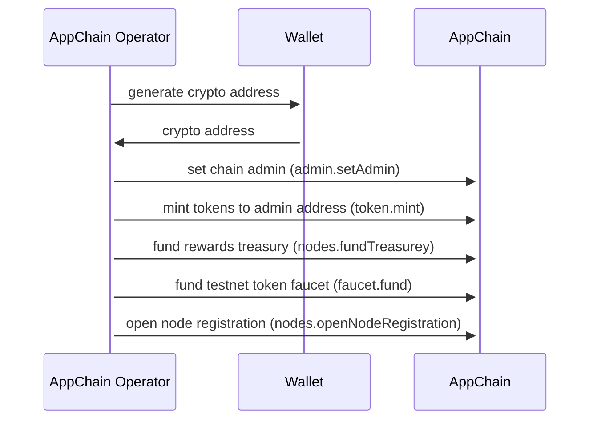
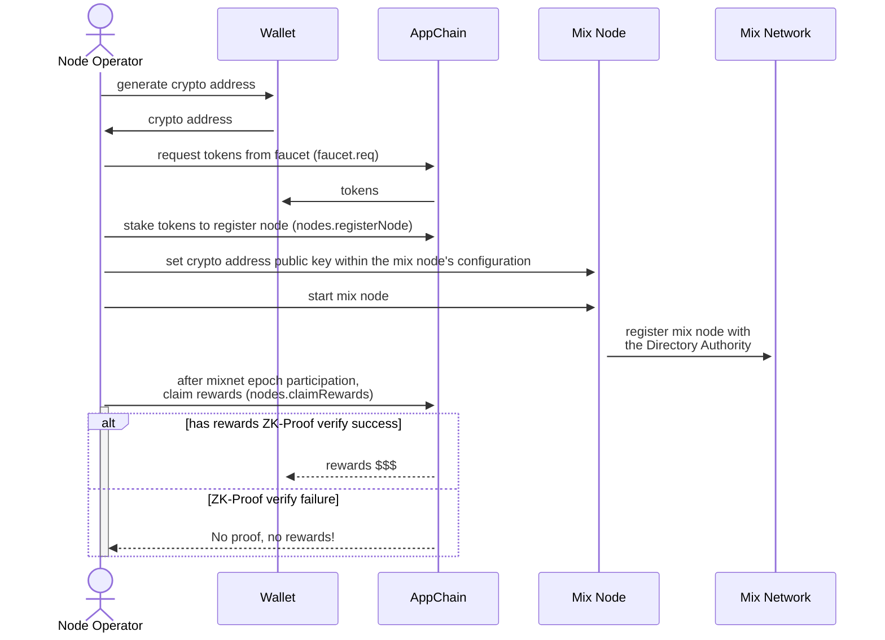

# 0KN AppChain Testnet Initialization

**Abstract**

This document describes the high level architecture and behavior for incentives
structure for decentralized mix network participation within the 0 Knowledge
Network. The approach is multi-phased with early test networks (with community
participants) used to validate ideas and apply learning to following testing
rounds. The initial phase and focus is one of "minimal viability" with
subsequent phases expected to have increasing complexities and features towards
mainnet. The goal of which is to produce a functional and sustainable tokenomic
model of increasing value for the network and its utility. Also, the final
incentivization configuration for mainnet launch is not intended to be static,
but rather stable, with ability to adapt dynamically to new developments and/or
features within the 0KN platform.

## 1. Introduction

### 1.1 Terminology

- `token` - A digital asset used within the 0KN platform to facilitate
  transactions, incentives, and governance.

- `mint` - The creation of new tokens within the network.

- `burn` - The permanent removal of tokens from circulation, typically as a
  penalty for nodes that perform poorly or act maliciously.

- `incentives` - Token rewards and penalties designed to promote desired
  behaviors within the network. Rewards enhance economic benefits for positive
  contributions, while slashing mechanisms penalize actions detrimental to the
  network's health.

- `stake` - The process by which network participants lock up tokens as a
  security deposit to participate in the network operations. Staking serves as a
  commitment to act in the network's best interest, under the threat of
  financial penalty (slashing) for misbehavior.

- `epoch` - A fixed period during which network operations are measured and
  assessed for rewards and penalties. Epochs help in organizing the evaluation
  of nodes' performances and the distribution of incentives.

- `operator` - Manager of a mix node. Typically a human.

- `appChain` - A [ProtoKit](https://0kn.io/docs/0KN/architecture/zkappchain#protokit)
  appchain with a series of runtime modules facilitating a token for node
  incentives. See [zkAppChain](https://0kn.io/docs/0KN/terminology).

Refer to [Katzenpost Glossary](https://katzenpost.network/docs/intro/glossary/)
for these:

- `mix` - The primary component used to compose a mix network.

- `Mixnet` - Mixnet is short for mix network which is a network of mix.

- `Node` - A Mix or Provider instance.

- `Provider` - A node in the mix network which is responsible for authenticating
  Client forwarding messages to the rest of the mix network on behalf of Client
  and queueing messages that can later be retrieved by Client

## 1 Node Identification

Nodes must uniquely identify themselves and register with the network to
participate. This process involves generating a cryptographic identity and
staking tokens to demonstrate commitment. Registration ensures only committed
and accountable nodes contribute to the network's operations.

A Node identifier is a `Mina` PublicKey. TODO: doc format, how many bytes, etc.

## 2 Staking (Node Registration)

Staking involves nodes locking up a minimum amount of tokens as collateral to
participate in the network. This financial commitment discourages malicious
behavior and provides a basis for penalizing nodes that fail to meet performance
standards.

### 2.1 Staking Conditionals

how to stake, minimum amount, where tokens originate from, etc

### 2.2 Unstaking

TODO: under what conditions. Note: unstaking below the minimum renders a Node
ineligible for rewards, essentially "unregistering" it.

cycle: epoch

## 3 Node Performance Metrics

- packet loss
- bandwidth
- uptime

### 3.1 Production Network Participation Requirements

Participation in the production network is contingent on meeting predefined
performance standards.

## 4 Rewards

Per epoch, rewards are distributed based on nodes' contributions to the network,
measured against their performance metrics.

### 4.1 Rewards Origins

- a rewards treasury
- future: utility fees collected by the network

### 4.2 Granting Rewards

### 4.3 Claiming Rewards

Operators can claim their rewards ~~after a certain period, allowing time for
any discrepancies or issues to be addressed~~ at any time. Rewards balance are
handled separate from staked amount.

Rewards Claims: Lock Mechanism

In subsequent incentives implementations (testnets), rewards may be locked for a
period of time before they are able to be claimed. This lock period may be
configurable as `token` runtime state configuration and/or amount claimed per
duration of time, and may additionally be dynamically tuned over time; for
example, as a conditional relation to percentage of total circulating supply. A
rewards claim lock mechanism may potentially serve one or more of the following:

1. Encouraging Long-Term Participation Lock periods incentivize participants to
   remain active and engaged with the network over a longer term. By delaying
   immediate access to rewards, participants are more likely to continue
   contributing to the network's security or liquidity, fostering a more stable
   and committed user base.

2. Reducing Market Volatility Immediate access to large volumes of rewards can
   lead to participants quickly selling their tokens, potentially flooding the
   market and causing price volatility. A lock period can help stagger the
   release of new tokens into circulation, mitigating sudden price drops and
   stabilizing the token's market value.

3. Preventing Malicious Behavior In some consensus mechanisms, especially Proof
   of Stake (PoS) or Delegated Proof of Stake (DPoS), lock periods can act as a
   deterrent against malicious activities. The threat of losing locked rewards
   or facing a longer delay before accessing them can discourage validators or
   delegates from behaving dishonestly.

4. Enhancing Network Security For networks that rely on staking, locking rewards
   can complement the staking mechanism by ensuring that participants have skin
   in the game for a longer duration. This alignment of incentives can enhance
   the overall security and integrity of the network, as participants have more
   to lose if the network is compromised.

5. Promoting Healthy Token Economics Lock periods can help manage the token's
   circulating supply more effectively, contributing to healthier token
   economics. By controlling the rate at which rewards are released into
   circulation, the network can manage inflation and support sustainable
   economic models.

6. Supporting Governance Participation In networks where token ownership and
   rewards entitle participants to governance rights, lock periods can encourage
   more thoughtful and long-term-oriented participation in governance decisions.
   Stakeholders with locked tokens may be more invested in the network's future
   outcomes, leading to more deliberate voting and governance activities.

7. Facilitating Reward Accumulation and Compounding Lock periods can allow for
   the accumulation and potentially the compounding of rewards, depending on the
   network's design. This can be particularly attractive for participants
   looking to maximize their returns over time, as they can earn rewards on
   their staked assets as well as on the rewards themselves if additional
   staking is allowed.

In summary, rewards claim lock periods are a strategic tool used by many
blockchain projects to align participant incentives with the long-term health
and success of the network. By carefully designing these mechanisms, projects
can encourage sustained engagement, maintain economic stability, and ensure the
security and integrity of the network.

Specifically within the context of 0KN, the threat of slashing locked rewards in
addition to stake may further incentivize longer-term healthy node behavior.

## 5 Penalties; aka Slashing

Slashing occurs when a node fails to meet the minimum performance standards or
acts maliciously. A portion of the staked tokens is burned as a penalty,
discouraging poor performance and harmful actions.

## 6 AppChain Modifications

This specification for the 0KN alpha testnet represents the initial expression
for an `appChain` of minimal complexity, establishing a base foundation for
functionality. The appChain serves as a _Decentralized Node Registration &
Incentives Authority_.

### 6.1 Runtime Modules

- admin
  - state
    - `admin`
  - methods
    - `setAdmin`
    - `assertSenderIsAdmin`
- token
  - state
    - `balances`
    - `stakes`
  - methods
    - `mint`
    - `burn`
    - `transfer`
    - `stake`
    - `unstake`
- nodes
  - config
    - `stakeMin` - minimum staked amount for node registration
  - state
    - `registeredNodes` - registered (and properly staked) nodes
    - `rewards` - rewards balances
    - `treasury` - A pool of tokens available to be distributed as rewards
  - methods
    - `fundTreasurey`
    - `unfundTreasurey`
    - `openNodeRegistration`
    - `closeNodeRegistration`
    - `registerNode`
    - `unregisterNode`
    - `networkReward`
    - `networkPenalty`
    - `claimRewards`
    - `isNodeRegistered`
    - `isNodeRegistrationOpen`

Iterative Modifications

A projected list of iterative changes include, but are not limited to:

- admin
  - state
    - `admin` ⟶ `admins`
  - methods
    - `addAdmin`
    - `delAdmin`
- token
  - config
    - `supplyMax`
  - state
    - `supplyCirculating`
    - `supplyTotal`
- nodes
  - config
    - `maxNodes`
    - `rewardsLockPeriod` - rewards lock period (expressed in epochs)
  - state
    - `numNodes`

### 6.2 Administration ⟶ Governance

In initial testnet(s), parameters (runtime module configuration) may simply be
set by, and only by, an administrative account. Some parameters are set only at
initialization.

Parameter Administration: Distributed Governance (DAØ)

Subsequent testnets may implement a DAO with private voting mechanism to 1)
source human input in network decision making 2) supplement and/or oversee
pragmatic network assessments. A number of parameters may be adjusted over time
to support sustained long-term health of the network amidst the rollout of new
features and/or response to unforeseen network effects.

## 7. Changes to the Katzenpost Directory Authority behavior

When choosing which mixes to include within a dirauth's published PKI document,
check with **appChain** for staking to confirm that a node, based on its
identity, is properly registered and staked.

Directory authorities must verify that a mix node is registered and has staked
the required tokens before including it in their PKI document. This process
ensures that only committed nodes are listed. This may be abstract to a simple
http or tcp request with the **appChain** for simple boolean response from a
given node identity and/or a structured document may be served for multiple
registered node identities.

## 8. Threat Model

Refer to developing specifications for:

- [Katzenpost Bandwidth Authority Specifications](https://github.com/katzenpost/katzenpost/blob/bw_auth_spec/docs/specs/bandwidth_authority.md).
- [Katzenpost Uptime Probe](https://github.com/katzenpost/katzenpost/blob/bw_auth_spec/docs/specs/mix_uptime_probe.md)
- [Katzenpost Packet Loss Detection](https://github.com/katzenpost/katzenpost/blob/bw_auth_spec/docs/specs/packet_loss_detection.md)

## 9. Protocol Description

### 9.1 AppChain Testnet Initialization

mostly performed by appchain deployment script

_alpha testnet init sequence_

### 9.2 Mix Node Operator Registration

performed by human mix node operator

_alpha testnet node registration and rewards claim_
